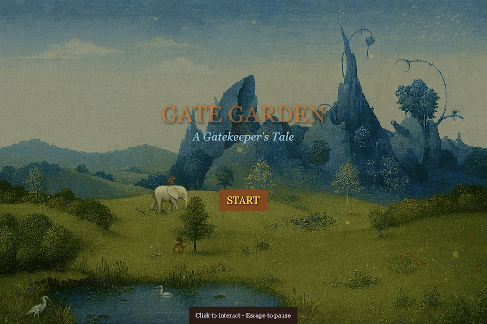

# Gate Garden - Phaser Game

Game inspired by Bosch's ["The Garden of Earthly Delights"](https://www.museodelprado.es/en/the-collection/art-work/the-garden-of-earthly-delights/02388242-6d6a-4e9e-a992-e1311eab3609). Talk to the mystical animals, solve their puzzles, and earn medals to open the ancient gate.

👉 [Play the game](http://ferandrade.com/gate-garden)

**Made with:** Phaser 3, TypeScript, and Vite. The game also includes a webhook for remote control of settings (disabled by default).

## Screenshots




## How to run

1. (Optional) To enable the webhook, create a `.env` file in the project root and add:

```
VITE_WEBHOOK_ENABLED=false
```

2. Install dependencies:

```sh
pnpm install # or npm install
```

3. Start the development server:

```sh
pnpm dev # or npm run dev
```
